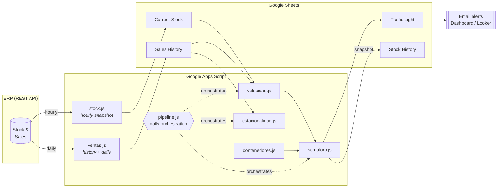

# Stock Intelligence — Stockout prevention on Google Apps Script

[Español](README.md) · **English**


An inventory *business intelligence* platform for a packaging importer. It crosses
near real-time stock with sales history to **anticipate stockouts before they
happen**, prioritize purchasing by urgency and understand the seasonality of each
product — all **with zero infrastructure of its own**: it runs entirely on Google
Apps Script + Google Sheets, fed by the ERP's REST API.

> A real production project, anonymized for portfolio use. Business data (brand,
> SKUs, suppliers, offices) lives outside version control (see
> [Configuration](#configuration)).

<p align="center">
  
</p>

<p align="center"><sub>Real output of the traffic light (SKU and description columns hidden for privacy).</sub></p>

---

## The problem

An importer with ~450 active SKUs and lead times of **75–120 days** (depending on
country of origin) faces a classic dilemma: ordering too much locks up capital;
ordering too little causes stockouts and **lost sales** in peak season. The
decision used to be made "on gut feeling", without crossing sales velocity with
stock or with the containers already in transit.

## Impact

> ### ≈ USD 100K in recovered sales in the first year
> Revenue that, without early visibility of stockouts, would have been lost to
> products sold out in peak season. *(internal estimate)*

Beyond the number:

- **Stockout visibility**: went from detecting them *after* losing the sale to
  **anticipating them weeks in advance**, ordered by urgency.
- **Quantified lost sales**: the historical snapshot makes it possible to estimate
  the units not sold due to out-of-stock — a figure that was previously invisible
  to management.
- **Less manual work**: replaced the weekly spreadsheet analysis with a pipeline
  that runs on its own every morning.
- **Data-driven purchasing**: velocity + seasonality + what is already on the way,
  instead of intuition.

## The solution

A daily pipeline that turns raw ERP data into an actionable **stockout traffic
light**, plus supporting analysis (velocity, seasonality, incoming imports) and
**automatic email alerts** when a product enters risk.



---

## Features

| Module | What it does |
|---|---|
| **Stockout traffic light** | Days of coverage (stock ÷ velocity) vs. the origin country's lead time → red/yellow/green state, ordered by urgency. |
| **Sales velocity** | Daily velocity per SKU across 3 windows (all-time / 180d / 90d), age-adjusted for new products. |
| **Seasonality** | Year × Month matrix per category; detects seasonal patterns and tells "zero sales" apart from "zero stock" (a stockout). |
| **Imports in transit** | Incoming units + ETA per SKU, to avoid over-ordering what is already on the way. |
| **Email alerts** | Automatic notice when a SKU newly enters red — only changes, no spam. |
| **Historical memory** | Daily stock snapshot to reconstruct past stockouts and compute lost sales. |
| **Daily pipeline** | Sales → velocity → traffic light chain, fault-tolerant (one failing module doesn't bring the rest down). |

---

## Architecture decisions

**Why Google Apps Script and not a "real" backend?**
The business already lived in Google Sheets and had no appetite for maintaining
servers. Apps Script gives *serverless* automation for free, right next to the
tool the team already uses. The cost: you must design **within its limits**
(executions capped at 6 min, `UrlFetchApp` quotas, a cell ceiling per spreadsheet).
Much of the design comes from respecting those constraints:

- **Parallel + resumable download.** The history is ~250k sales lines, impossible
  to pull in a single 6-minute execution. The solution uses `UrlFetchApp.fetchAll`
  to request **~20 pages in parallel per round** (~1,000 documents), walks from
  newest to oldest, and **stops itself at 5 min**, saving progress in *Script
  Properties* to resume on the next run (manual or by trigger).
- **Atomic write.** If the ERP fails mid-download, the sheet keeps its last good
  version instead of ending up empty — an empty stock would read as a false "total
  stockout".
- **Incremental update.** The day-to-day doesn't re-download everything: a marker
  with the ID of the last stored document (`VR_MAX_ID`) brings only what's new.
- **Fault-tolerant pipeline.** Each stage (sales → velocity → traffic light) has
  its own `try/catch`: if the ERP is down, the traffic light still recomputes with
  the hourly stock already available.
- **Configuration outside the repo.** Every business value is injected at runtime
  from a file that git ignores but `clasp` does deploy (see
  [Configuration](#configuration)).

## A look at the code

Atomic write: the sheet isn't touched until there's good data, so a network
failure never turns into a phantom "stockout".

```javascript
// If the ERP failed mid-way, _fetchBsale already threw and we never got here → the
// sheet keeps its last good version (avoids leaving it empty = false "stockout").
if (!filas.length) {
  throw new Error('The ERP returned no stock. The sheet was NOT modified.');
}
var sheet = _prepararHoja(STOCK_CONFIG.SHEET_NAME, STOCK_HEADERS);
sheet.getRange(2, 1, filas.length, STOCK_HEADERS.length).setValues(filas);
```

## Challenges and learnings

- **"Zero sales" ≠ "zero stock".** A month with no sales can be lack of demand *or*
  a hidden stockout. Telling them apart (with the historical snapshot) was key to
  not penalizing products that do sell when there is stock.
- **Deduplicating ~250k lines** without blowing past the spreadsheet's limits,
  walking from newest to oldest to always keep what matters most.
- **Modeling origin uncertainty.** The country (and therefore the lead time) isn't
  always in the catalog: it's resolved as a cascade (catalog → container prefix →
  SKU pattern → keyword → default).
- **Working inside a constrained environment** (6 min, quotas) forces you to think
  about *checkpoints*, idempotency and fault tolerance from the design stage.

---

## Stack

- **Google Apps Script** (JavaScript / V8 engine) — *serverless* logic.
- **Google Sheets** — data and presentation layer.
- **ERP REST API** — source of stock and sales (pagination, token auth, parallel `fetchAll`).
- **`clasp`** — code deployment from local.
- **Looker Studio** — dashboards for management.
- **MailApp / Triggers** — automation and scheduled alerts.

## Structure

```
├── apps_script/
│   ├── stock.js              # Stock snapshot from the ERP (hourly, atomic)
│   ├── ventas.js             # Sales history + incremental update
│   ├── velocidad.js          # Sales velocity per SKU (3 windows)
│   ├── semaforo.js           # Stockout traffic light + email alerts
│   ├── estacionalidad.js     # Seasonal analysis per category
│   ├── contenedores.js       # Imports in transit + ETA
│   ├── ventas_mensuales.js   # Monthly aggregate for BI
│   ├── archivo_stock.js      # Daily historical stock snapshot
│   ├── pipeline.js           # Daily orchestration (triggers)
│   ├── dashboard.js / .html  # Summary UI
│   ├── utilidades.js         # Formatting helpers
│   ├── config_local.example.js  # Business configuration template
│   ├── .clasp.json.example      # clasp deployment template
│   └── appsscript.json          # Apps Script project manifest
├── LICENSE
└── README.md
```

## Getting started

> Requires a Google account and [`clasp`](https://github.com/google/clasp)
> (`npm i -g @google/clasp`).

```bash
# 1. Clone
git clone https://github.com/<user>/<repo>.git && cd <repo>/apps_script

# 2. Create the local config from the templates
cp config_local.example.js config_local.js   # fill in with your data
cp .clasp.json.example .clasp.json            # set your scriptId

# 3. Authenticate and deploy
clasp login
clasp push
```

Then, in the Apps Script editor: store the ERP token in *Script Properties* and
install the triggers (`instalarTriggerPipeline()`, `instalarTriggerStock()`).

## Configuration

All business-specific data is kept **outside the repository**:

1. Copy `apps_script/config_local.example.js` → `config_local.js`.
2. Fill in the real values (brand, offices, origin mapping, categories).
3. `config_local.js` is in `.gitignore`, but `clasp` **does** upload it to Apps
   Script — so the code works without exposing data in git.

The rest of the code reads that configuration from `NEGOCIO.*` at runtime; there
is not a single business literal under version control.

---

## Status and limitations

- **In production**: stock/sales download, velocity, stockout traffic light, daily
  pipeline, email alerts and historical snapshot.
- **Evolving**: dashboard, seasonality per category and the cross-check with
  imports in transit.
- **Known limits**: subject to Apps Script quotas; persistence is Google Sheets
  (not a database), which imposes volume ceilings mitigated by compacting the
  history.

## Author

**Ignacio Domingo**

[LinkedIn](https://www.linkedin.com/in/ignacio-domingo-penas/) · [GitHub](https://github.com/ignaciodomingo-dev)

## License

[MIT](LICENSE) — © 2026 Ignacio Domingo. Sample code for portfolio purposes; no
real company data.
