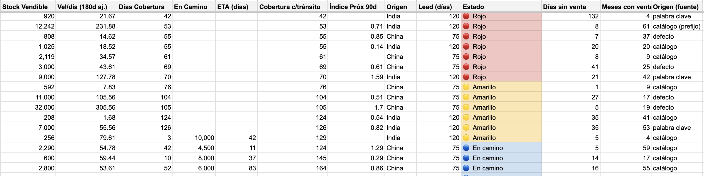
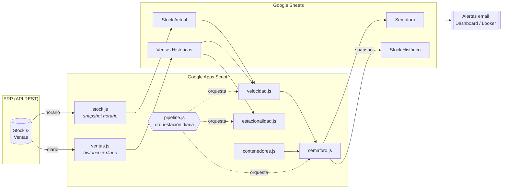

# Stock Intelligence — Prevención de quiebres sobre Google Apps Script


Plataforma de *business intelligence* de inventario para una importadora de
packaging. Cruza el stock en tiempo casi real con el histórico de ventas para
**anticipar quiebres antes de que ocurran**, priorizar compras por urgencia y
entender la estacionalidad de cada producto — todo **sin infraestructura
propia**: corre íntegramente sobre Google Apps Script + Google Sheets,
alimentado por la API REST del ERP.

> Proyecto real en producción, anonimizado para portfolio. Los datos de negocio
> (marca, SKUs, proveedores, oficinas) viven fuera del control de versiones
> (ver [Configuración](#configuración)).

<p align="center">
  
</p>

<p align="center"><sub>Salida real del semáforo (columnas SKU y descripción ocultas por privacidad).</sub></p>

---

## El problema

Una importadora con ~450 SKUs activos y lead times de **75–120 días** (según
país de origen) enfrenta dilema que se genera al pedir de más, puesto que se inmoviliza capital;
pedir de menos genera quiebres y **ventas perdidas** en plena temporada. La
decisión se tomaba "a intuición", sin cruzar velocidad de venta con stock ni con
los contenedores en tránsito.

## Impacto

> ### ≈ CLP 100 millones en ventas recuperadas el primer año
> Facturación que, sin visibilidad anticipada de los quiebres, se habría perdido
> por productos agotados en plena temporada. *(estimación interna)*

Además del número:

- **Visibilidad de quiebres**: pasó de detectarlos *después* de perder la venta a
  **anticiparlos con semanas de anticipación**, ordenados por urgencia.
- **Ventas perdidas cuantificadas**: el snapshot histórico permite estimar las
  unidades no vendidas por falta de stock — un dato que antes era invisible para
  gerencia.
- **Menos trabajo manual**: reemplazó el análisis semanal en planillas por un
  pipeline que corre solo cada mañana.
- **Decisión de compra basada en datos**: velocidad + estacionalidad + lo que ya
  viene en camino, en vez de intuición.

## La solución

Un pipeline diario que convierte datos crudos del ERP en un **semáforo de
quiebre** accionable, más análisis de apoyo (velocidad, estacionalidad,
importaciones en camino) y **alertas automáticas por email** cuando un producto
entra en riesgo.



---

## Funcionalidades

| Módulo | Qué hace |
|---|---|
| **Semáforo de quiebre** | Días de cobertura (stock ÷ velocidad) vs. lead time del país de origen → estado rojo/amarillo/verde, ordenado por urgencia. |
| **Velocidad de venta** | Velocidad diaria por SKU en 3 ventanas (histórica / 180d / 90d), ajustada por antigüedad para productos nuevos. |
| **Estacionalidad** | Matriz Año × Mes por categoría; detecta patrones de temporada y distingue "cero venta" de "cero stock" (quiebre). |
| **Importaciones en tránsito** | Unidades por llegar + ETA por SKU, para no sobre-pedir lo que ya viene en camino. |
| **Alertas por email** | Aviso automático cuando un SKU entra **nuevo** en rojo — solo cambios, sin spam. |
| **Memoria histórica** | Snapshot diario del stock para reconstruir quiebres pasados y calcular ventas perdidas. |
| **Pipeline diario** | Cadena ventas → velocidad → semáforo tolerante a fallos (un módulo caído no tumba al resto). |

---

## Decisiones de arquitectura

**¿Por qué Google Apps Script y no un backend?**
El negocio ya vivía en Google Sheets y no tenía sentido mantener servidores.
Apps Script da automatización *serverless* gratis, pegada a la herramienta que el
equipo ya usa. El costo: hay que diseñar **dentro de sus límites** (ejecuciones
de máx. 6 min, cuotas de `UrlFetchApp`, tope de celdas por planilla). Buena parte
del diseño nace de respetar esas restricciones:

- **Descarga paralela + resumible.** El histórico son ~250k líneas de venta,
  imposible de bajar en una sola ejecución de 6 min. La solución usa
  `UrlFetchApp.fetchAll` para pedir **~20 páginas en paralelo por ronda**
  (~1.000 documentos), recorre de lo más nuevo a lo más viejo, y **se corta solo
  a los 5 min** guardando el progreso en *Script Properties* para reanudar en la
  siguiente corrida (manual o por trigger).
- **Escritura atómica.** Si el ERP falla a mitad de una descarga, la hoja
  conserva su última versión buena en vez de quedar vacía — un stock vacío se
  leería como "quiebre total" falso.
- **Actualización incremental.** El día a día no re-baja todo: un marcador con el
  ID del último documento guardado (`VR_MAX_ID`) trae solo lo nuevo.
- **Pipeline tolerante a fallos.** Cada etapa (ventas → velocidad → semáforo) va
  en su propio `try/catch`: si el ERP está caído, el semáforo igual se recalcula
  con el stock horario ya disponible.
- **Configuración fuera del repo.** Todo dato de negocio se inyecta en runtime
  desde un archivo que git ignora pero `clasp` sí despliega (ver
  [Configuración](#configuración)).

## Un vistazo al código

Escritura atómica: no se toca la hoja hasta tener datos buenos, para no
transformar un fallo de red en un "quiebre" fantasma.

```javascript
// Si el ERP falló a mitad, _fetchBsale ya lanzó y nunca llegamos acá → la hoja
// conserva su última versión buena (evita dejarla vacía = "quiebre" falso).
if (!filas.length) {
  throw new Error('El ERP no devolvió stock. NO se modificó la hoja.');
}
var sheet = _prepararHoja(STOCK_CONFIG.SHEET_NAME, STOCK_HEADERS);
sheet.getRange(2, 1, filas.length, STOCK_HEADERS.length).setValues(filas);
```

## Desafíos y aprendizajes

- **"Cero venta" ≠ "cero stock".** Un mes sin ventas puede ser falta de demanda
  *o* un quiebre encubierto. Distinguirlos (con el snapshot histórico) fue clave
  para no castigar productos que sí venden cuando hay stock.
- **Deduplicar ~250k líneas** sin reventar los límites de la planilla, recorriendo
  de lo más nuevo a lo más viejo para siempre quedarse con lo que pesa.
- **Modelar la incertidumbre del origen.** El país (y por ende el lead time) no
  siempre está en el catálogo: se resuelve en cascada (catálogo → prefijo de
  contenedor → patrón de SKU → palabra clave → defecto).
- **Trabajar dentro de un entorno restringido** (6 min, cuotas) obliga a pensar en
  *checkpoints*, idempotencia y tolerancia a fallos desde el diseño.

---

## Stack

- **Google Apps Script** (JavaScript / motor V8) — lógica *serverless*.
- **Google Sheets** — capa de datos y presentación.
- **API REST del ERP** — fuente de stock y ventas (paginación, token, `fetchAll` paralelo).
- **`clasp`** — despliegue del código desde local.
- **Looker Studio** — dashboards para gerencia.
- **MailApp / Triggers** — automatización y alertas programadas.

## Estructura

```
├── apps_script/
│   ├── stock.js              # Snapshot de stock desde el ERP (horario, atómico)
│   ├── ventas.js             # Histórico de ventas + actualización incremental
│   ├── velocidad.js          # Velocidad de venta por SKU (3 ventanas)
│   ├── semaforo.js           # Semáforo de quiebre + alertas email
│   ├── estacionalidad.js     # Análisis estacional por categoría
│   ├── contenedores.js       # Importaciones en tránsito + ETA
│   ├── ventas_mensuales.js   # Agregado mensual para BI
│   ├── archivo_stock.js      # Snapshot histórico diario del stock
│   ├── pipeline.js           # Orquestación diaria (triggers)
│   ├── dashboard.js / .html  # UI de resumen
│   ├── utilidades.js         # Helpers de formato
│   ├── config_local.example.js  # Plantilla de configuración de negocio
│   ├── .clasp.json.example      # Plantilla de despliegue clasp
│   └── appsscript.json          # Manifiesto del proyecto Apps Script
├── LICENSE
└── README.md
```

## Puesta en marcha

> Requiere una cuenta de Google y [`clasp`](https://github.com/google/clasp)
> (`npm i -g @google/clasp`).

```bash
# 1. Clonar
git clone https://github.com/<usuario>/<repo>.git && cd <repo>/apps_script

# 2. Crear la config local a partir de las plantillas
cp config_local.example.js config_local.js   # completar con tus datos
cp .clasp.json.example .clasp.json            # poner tu scriptId

# 3. Autenticar y desplegar
clasp login
clasp push
```

Luego, en el editor de Apps Script: guardar el token del ERP en *Script
Properties* e instalar los triggers (`instalarTriggerPipeline()`,
`instalarTriggerStock()`).

## Configuración

Todos los datos específicos del negocio se mantienen **fuera del repositorio**:

1. Copiar `apps_script/config_local.example.js` → `config_local.js`.
2. Completar los valores reales (marca, oficinas, mapeo de orígenes, categorías).
3. `config_local.js` está en `.gitignore`, pero `clasp` **sí** lo sube a Apps
   Script — así el código funciona sin exponer datos en git.

El resto del código lee esa configuración desde `NEGOCIO.*` en tiempo de
ejecución; no hay un solo literal de negocio versionado.

---

## Estado y limitaciones

- **En producción**: descarga de stock/ventas, velocidad, semáforo de quiebre,
  pipeline diario, alertas por email y snapshot histórico.
- **En evolución**: dashboard, estacionalidad por categoría y el cruce con
  importaciones en tránsito.
- **Límites conocidos**: sujeto a las cuotas de Apps Script; la persistencia es
  Google Sheets (no una base de datos), lo que impone topes de volumen que se
  mitigan compactando el histórico.

## Autor

**Ignacio Domingo**

[LinkedIn](https://www.linkedin.com/in/ignacio-domingo-penas/) · [GitHub](https://github.com/ignaciodomingo-dev)

## Licencia

[MIT](LICENSE) — © 2026 Ignacio Domingo. Código de ejemplo con fines de
portfolio; sin datos reales de la empresa.
